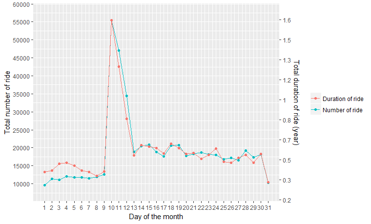
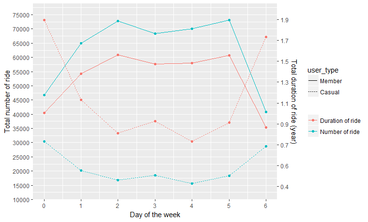
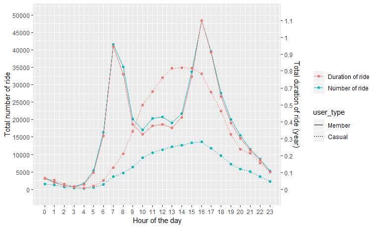
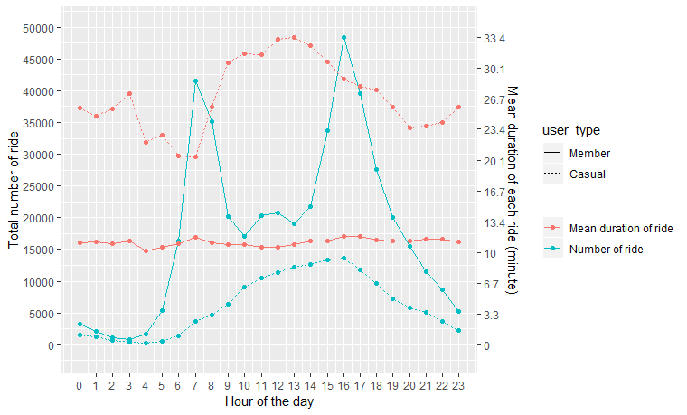

# Analysis of Bike Share Ridership in Toronto 🚴🚴🚴

Data source: [www.toronto.ca](https://www.toronto.ca/city-government/data-research-maps/open-data/open-data-catalogue/#343faeaa-c920-57d6-6a75-969181b6cbde)

Google API
* Geocoding to get lat, lon
* Distance Matrix to measure distance and duration from A to B, 
* These cost $0.5 USD per 1000 requests 💰!

Languages and packages
* R
  * data.table
  * ggplot
  * plotly
  * rmarkdown
  * crosstalk
  * leaflet
  * geosphere
  * igraph
  * caret
  * randomforest
  * corrplot
  * DT
* JavaScript  

# Overview
In the 2016 data, the bikers racked up:
* Trip number: 585521
* Trip duration: 555470488 seconds or 154297 hours or 6429 days or 17.6 years
* Trip distance: 332617 Km (206678 mi), enough to circle 🌍 8 times! Distances were measured using Google Distance Matrix API.

There are:
* 201 stations

# Trip

585521 trips

|| Mean | Min | Q1 | Median | Q2 | Max |
| --- | --- | --- | --- | --- | --- | --- |
| Duration (second) | 948 | 60 | 437 | 667 | 1038 | 14400 |
| Distance* (m) | 2286 | 0 | 1254 | 2026 | 3020 | 24778 |
| Velocity* (Km/h) | 13.0 | 0.003 | 9.0 | 11.6 | 14.1 | 447.4 |

*Distance and velocity were estimated using Google Matrix Distance API

**Interactive plots can be found at https://kienly.shinyapps.io/bike/**

By month and week
* Most trips occur during summer 🌞, as expected.
* Most popular are Aug (138590 trips), Sep (137384 trips)
* Least popular are Jan (8431 trips), Feb (8572 trips)

By day of the week
* Most popular is Friday (91623 trips) by the number of trip
* Least popular is Saturday (96461 trips) by the number of trip
* However, by duration of trip:
  * Most popular is Sunday (2.90 years)
  * Least popular is Thursday ()

By day of the month
* Most popular is on the 10th (55529 trips), a big spike compared to the 9th 🤔? (there are many missing data from 1st to 10th)
* Least popular is on the 1st (9681 trips)

By hour of the day
* Busy times are from 11 AM to 1 PM, then from 7 PM to 10 PM
* Most popular is at 9 PM 🌙 (62008 trips)
* Least popular is at 8 AM (1110 trips)

## Observations
* The number of trip and total trip duration are usually agree with each other by month, by week, by hour; i.e. the more number of trip the higher the total trip duration. However when grouped by **day of the week**, weekends (Saturday and Sunday) have low number of trips but longer total trip duration [graph](). Perhaps people enjoy having a **leisurely ride over the weekends**.
* On the **10th day of of each month**, the number of trip increases dramatically, turned out to be due to missing data.
* Mean trip velocity (12.97 Km/h) is slightly smaller than Google guessed velocity (14.75 Km/h) with both t-test and Wilcoxon test p-value < 0.001.
* According to [Wikipedia](https://en.wikipedia.org/wiki/Bicycle_performance), a human typically ride a bike at 16 - 24 Km/h. So our riders are a bit "slow"?
* There are some trips (N = 1994, 0.34% of all trips) where velocity exceeds 50 Km/h. Of them 1389 are in 50 - 75 Km/h, 368 are in 75 - 100 Km/h, 209 are in 100 - 200 Km/h and 28 are over 200 Km/h. Possible explanation:
  * Distance measured by Google API were incorrect
  * Duration reported by bikes were incorrect. If this is the case, the company may be losing **revenue** 💸
  * Riders put bikes onto a 🚗?
* There are 38284 trips (6.54% of all trips) exceeding 30 mins ride. The total exceeding time is about 26000 hours. Assuming the [overage fee](https://bikesharetoronto.com/plan-details/) is $4 per 30 mins, so this equates to ~$52000 💰 🤑 💵!

# Station
 201 of them

Click the image above for the interactive map

 * The most popular station: Union Station - 9378 origin trips, 12379 destination trips
 * The least popular station: Base Station - 3 origin trips, 4 destination trips

From station to station
* There are 30266 combinations of routes from station A to station B. On average, each route was ridden by 19 trips.
* The most popular:
  * from Bay St / Queens Quay W (Ferry Terminal) to Bay St / Queens Quay W (Ferry Terminal): 1502 trip, possibly people just ride around and around
  * from York St / Queens Quay W to York St / Queens Quay W: 848 trips
  * from Union Station to Front St W / Blue Jays Way: 701 trips
* The least popular: there are 4316 trips where only 1 instance of A to B were recorded
* There are 200 routes where riders departed and returned to the same station. These represent 17567 trips (3% of all trips), with a total duration of 16169 hours or 1.8 years (10.4% of total trip duration). These trips tend to be longer in duration (median of 29 minutes) compared to the median of 11 minutes in all trips (more in the user_type below).

When considering the route from A -> B is the same as the route from B -> A:
* There are 16887 of such routes
* The most popular in terms of number of trips are:
  * between 161 Bleecker St (South of Wellesley) and York St / Queens Quay W: 1200 trips
  * between Front St / Yonge St (Hockey Hall of Fame) and Gould St / Mutual St: 1088 trips
  * between King St W / Spadina Ave and Union Station: 1073 trips
* The most popular in terms of duration of trips are:
  * between Bay St / Queens Quay W (Ferry Terminal) York St / Queens Quay W: 455 hours
  * between 161 Bleecker St (South of Wellesley) York St / Queens Quay W: 288 hours
* The most popular in terms of distance of trips are:
  * between 161 Bleecker St (South of Wellesley) York St / Queens Quay W: 4794 km
  * between Church St  / Wood St Ontario Place Blvd / Remembrance Dr: 2929 km
* In terms of median **velocity**:
  * For those routes with more than 500 trips:
    * 161 Bleecker St (South of Wellesley) York St / Queens Quay W: 28 Km/h
    * Bay St / Albert St Bay St / College St (East Side): 20 Km/h
  * For those routes with 100 to 500 trips:
    * College St W / Huron St College St W / Major St: 62 Km/h
    * 161 Bleecker St (South of Wellesley) King St W / Tecumseth St: 53 Km/h

Not all A -> B trips are the same as B -> A trips. For example, between Bleecker St (South of Wellesley) (A) and York St / Queens Quay W (B), distance of 3.0 km:

| Route | Number of trip | Total duration (hour) | Mean duration (minute) | Velocity (Km/h) | 
| --- | --- | --- | --- | --- |
| A -> B | 690 | 151 | 13 | 27 |
| B -> A | 510 | 136 | 16 | 23 |

Statistical test indicate that the duration and velocity from A -> B are significantly different from B -> A, with t.test p-value < 10-9, Wilcoxon p-value < 10-10 and permutation test p-value = 0 (10000 trials).
Maybe there are terrestrial differences (slope), wind direction?

### Distance
The two furthest stations are: Bloor St W / Dundas St W and Danforth Ave / Barrington Ave: 13 Km. No trip was registered on this route *YET* 😎.

# User

🚲 Riders with membership are quite different from casual riders 🙂 🚲

### All trips

| User | Number of trip | Total duration (year) | Mean duration per trip (minute ±SE) | Total distance* (Km) | Mean distance* per trip (Km ±SE) | Velocity* (Km/h ±SE) | 
| --- | --- | --- | --- | --- | --- | --- |
| All | 585530 | 17.6 | 16 ±0.0268 | 1338299 | 2.28 ±0.0020 | 12.0 ±0.0087 |
| Member | 436692 (75%) | 9.4 (53%) | 11 ±0.0119 | 977951 | 2.24 ±0.0021 | 12.9 ±0.0095 |
| Casual | 148838 (25%) | 8.3 (47%) | 29 ±0.0909 | 360374 | 2.42 ±0.0047 | 9.0 ±0.0178 |

*Distance and velocity were estimated using Google Matrix Distance API

### Trips where pick up and drop off locations are the same

| User | Number of trip | Total duration (year) | Mean duration per trip (minute ±SE) |
| --- | --- | --- | --- |
| All | 17567 | 1.85 | 55 ±0.4443 |
| Member | 4958 (28%) | 0.16 (9%) | 17 ±0.3371 |
| Casual | 12609 (72%) | 1.68 (91%) | 70 ±0.5504 |

**Interactive plots can be found at https://kienly.shinyapps.io/bike/**

In weekdays, there are more members on the bikes. But in weekend, causal riders roam the city.

In a typical day, members are more active between 11 AM and 2 PM, then between 7 PM and 10 PM. On the other hand, casual riders are more active between 3 PM and 10 PM.

Futhermore, if looking at mean duration of each ride, members spent about 11 minutes in each trip, regardless hour of the day. There are more fluctuation in the mean duration of each ride for casual riders, they spent from an average of 20 minutes to 33 minutes.

There are many differences between riders with membership and casual riders
* Three quarters of the trips were clocked by riders with membership.
* But casual riders traversed similar duration and distance compared to riders with membership.
* Casual riders were more "casual" in speed, riding about 4 Km/h slower compared to members, and with higher variations in speed. Whereas members cruised at a steady 12.9 Km/h.
* Casual riders also tended to pick up and drop off the bikes at the same place. Of the 17567 trips with the same origin and destination location, casual riders constituted 72% of these trips.
* Interestingly, for all trips, the average trip duration for causal riders is 29 min, just under the threshold of **overage fee** of 30 minutes, so they do not have to pay extra? But for trips with the same pick up and drop off location, the average duration is 70 minutes. It is possible they were enjoying the slow rides around the city and did not mind the overage fee.

# Comments & further work
* There are many more trips (16x more) in the the most popular month (Aug) compared to the least popular month (Jan), is this real or the data are not complete?
* Matrix distance from Google API are approximate only, it would be more helpful if the dataset includes geolocation of the stations.
* In addition, the measured distances were based on "best guest", riders could have taken various routes.
* It would be more useful if the dataset also includes: bike_id, user_id, member_type so that more insight can be extracted:
  * Which bikes are the most popular?
  * Which bikes have traversed most distances?
  * Which users are the top riders in terms of trip, distance and velocity?
  * Are there differences between member_type?
* Compare ridership with weather data, it is expected that sunny days attract more riders. It is possible to look at: rain, snow, humidity, wind and how do these affect trip duration, trip distance, trip velocity.
* As the median trip is about 11 minute, are there ways to structure pricing strategy to lower the fee and increase ridership so both the company and consumers and the earth will benefit from riding a bike
* There are differences between riders with membership and casual riders: time of the week, time of the day, duration, velocity, locations.
* Casual riders took up only 1/4 of all the total trips but they amounted to nearly half of the total trip duration. Are casual riders local residents or tourists?
* For some routes (College St, Bleecker St), users travelled more than 50 Km/h. Why?
* Predicting trip demand, trip duration, trip routes using machine learning algorithms, from linear regression, Random Forest to neural network.

# 🌞 🚴‍‍ 🚵‍ 💨 ‍‍🚴‍‍ 🚵‍ 🌴 ‍‍🚴‍‍ 🚵‍ 🌙 ⛄ ‍‍🚴‍‍ 🚵‍ 🌎

---

[Part 2](part2.md)