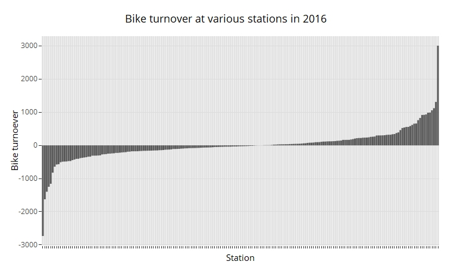
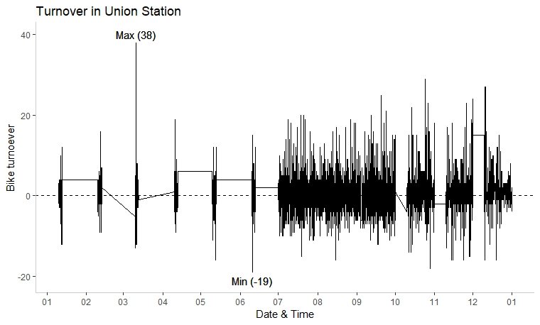
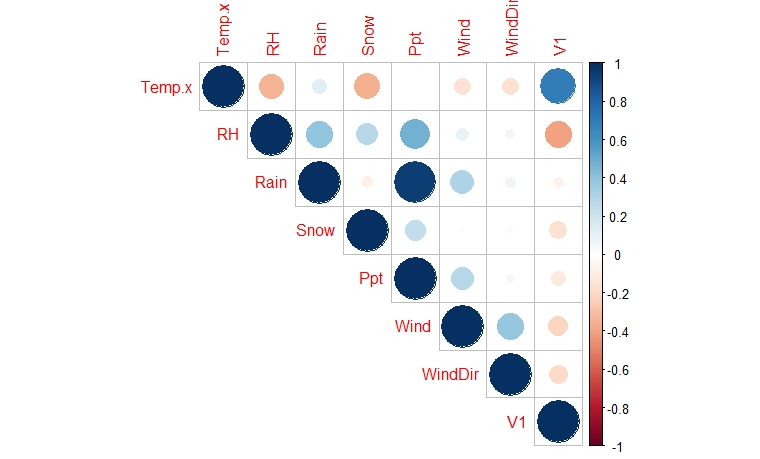
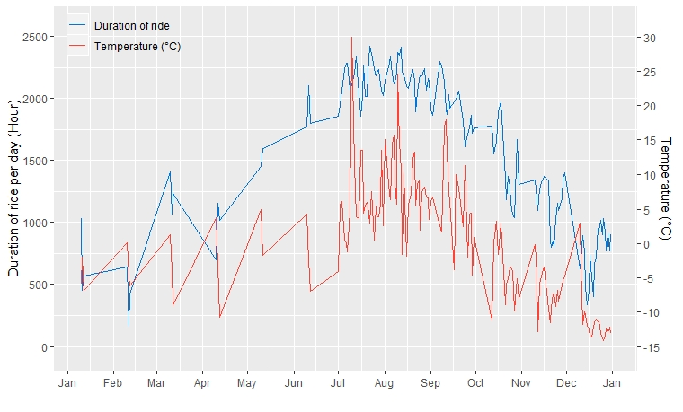
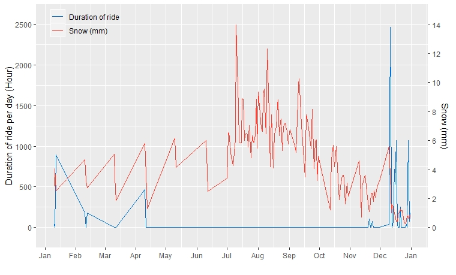

# Bike turnover

We want to make sure that in each station, there are enough bikes so whenever users want a bike, there should be a free one to take and when a user returns a bike, there should be an empty rack.

We assume that in each station, when a bike is taken out of a rack 🔓, there will be an empty "slot" which can be filled by another incoming bike 🔒. So on average, the number of "out" bikes should cancel out the number of "in" bikes.

But we find a different pattern

Click the image above for more detail

- in Station Bay St / Wellesley St W, **2733** more bikes were taken out than anticipated
- in Union Station, **3006** more bikes were put in than anticipated

## Union Station
Let's have a closer look at Union Station. We will determine the kind of event (-1: bike taken out, 1: bike put back in), number of event (n) and the time range. Such as below

|| event | n | from | to | duration (sec) |
| --- | --- | --- | --- | --- | --- |
| 1 | -1 | 2 | 2016-01-10 00:10:00 | 2016-01-10 00:13:00 |180
| 2 | 1 | 1 | 2016-01-10 00:20:03 | 2016-01-10 00:20:03 | 0
| 3 | -1 | 1 | 2016-01-10 00:58:00 | 2016-01-10 00:58:00 | 0
| 4 | 1 | 3 | 2016-01-10 01:04:27 | 2016-01-10 01:20:11 | 944

The table shows that from 00:10:00 to 00:13:00 (3 minutes), 2 bikes were taken out. This is followed at 00:20:03 where 1 bike was put back in.

By tallying up these events, we found that:
- From 2016-03-10 18:29:07 to 2016-03-10 20:54:48 (146 minutes) 38 bikes were put in continuously with no bike being taken out. Mmm, there must be at least 38 racks at the station 🤔?
- From 2016-06-10 11:20:00 to 2016-06-10 11:58:00 (38 minutes) 19 bikes were taken out continuously. So at least there must be 19 racks too.

Click the graph for a larger version.

The data is not complete, there are many periods when nothing happened 😣.

# Weather ☀️☁️🌈🌧️🌦️🌨️❄️💨

I am pretty sure that weather affects ridership, but which weather factors: temperature, humidity, rain, snow, wind. Let's check out

- Obtain the weather data from ftp://ftp.tor.ec.gc.ca/Pub/Get_More_Data_Plus_de_donnees/ for Toronto

### For all user

Duration of ride per day (V1) is positively associated with temperature, but negatively associated with humidity. Rain , snow, and wind do not seem to affect riding duration.

The correlation between riding duration and temperature:
- All user: 0.599
- Member: 0.488
- Casual: 0.700

Linear regression of model: 
`duration ~ user_type * (temperature + humidity + rain + snow + precipitation + wind)`

| variable | beta |  |
| --- | --- | --- | --- | --- | --- |
| Intercept | 501.9 |
| Casual user | -24.5 | 
| Temp | 9.2 |
| Humidity | -2.7 |
| Casual user : Temp | 12.4 |
| Casual user : Humidity | -3.1 |

So members, each degree increase in temperature (C), is associated with 9.2 hours increase in riding duration per day. However, for casual riders, it's 9.2 + 12.4 = 21.6 hours increase in riding duration.

Linear regression is not the best to model temperature, as when it's too hot, noone wants to ride as well!

We can see that as the days get warmer, the more people are out on bike.

Obviously, it doesn't snow in summer and autumn 😅

The R2 of the model is 0.4578, while that of temperature alone is 0.42, and humidity alone is 0.1409
So ~46% of the variation in the duration of rides can be attributed to temperature and humidity, what about the rest? Number of visitor, oil/gasoline price, bus driver on strike?

# Air traffic

🤔 Will the number of tourists arriving in Toroto be associated with the number of casual ridership?
Trying to get the data: **air passengers coming to Toronto per day**

# Oil price

# Prediction

Model: `duration ~ user_type + temperature + humidity + rain + snow + precipitation + wind + week`

Using *caret package* 

| Method | RMSE | R2 | MAE | |
| --- | --- | --- | --- | --- | --- |
| lm | 244.91 | 0.3947 | 187.25 |
| rf | 214.42 | 0.5310 | 159.34 | mtry = 15, ntree = 500

